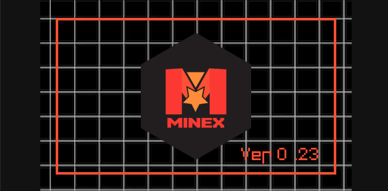
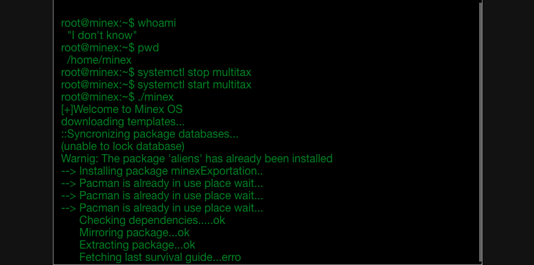
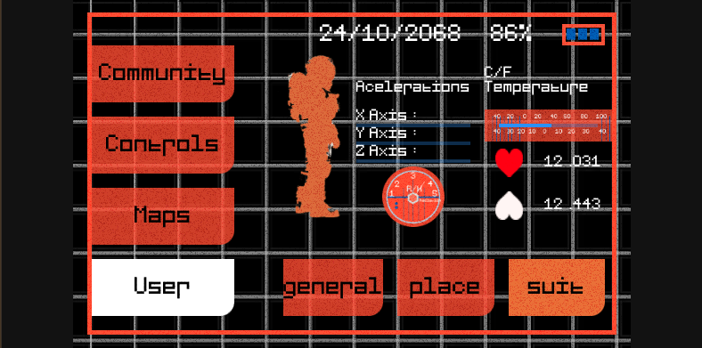
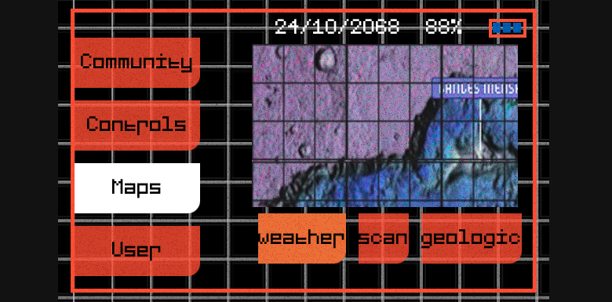
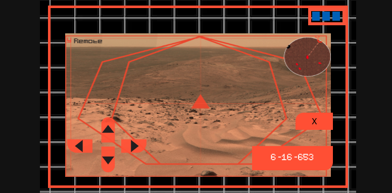

# Multitax by Minex

Multitax is a cross-platform application, helping (fictional) Minex employees to handle and manage their Mars exploration.


## Fic Features

- [x] View Minex community updates
- [x] Ship driving system (to cross Mars)
- [x] Sensors Statistics
- [x] Maps View in different layers **Radiation**, **Geological**, **Weather**, **Scan**

## Views








## Run application

1. Clone the repository
```bash
git clone https://github.com/Cotbert2/mutltitax.git
cd ./multitax
```

2. Install dependencies
```bash
npm install
```

3. Initialize the application in debug mode for browser:

To launch in your localhost:
```bash
ionic serve
```

if you want cross-Lan set up use:

```bash
ionic serve --host"x.x.x.x"
```

4. Open Android App (Android Studio)
```bash
npx open android
```

5. Open iOS App (Xcode)
```bash
npx open ios
```